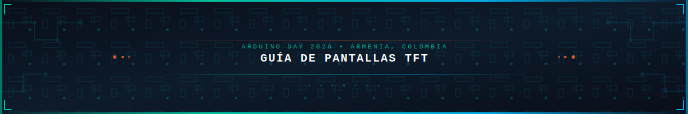
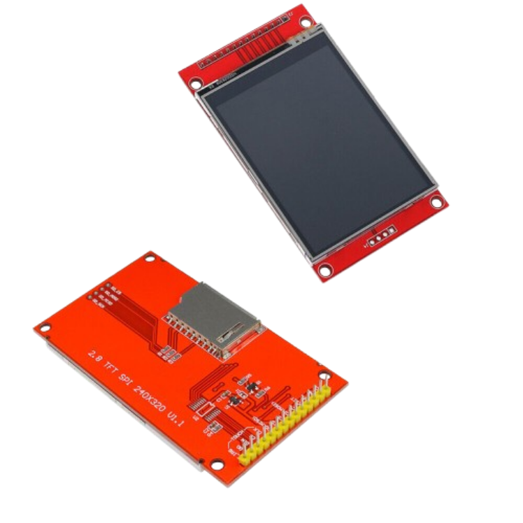
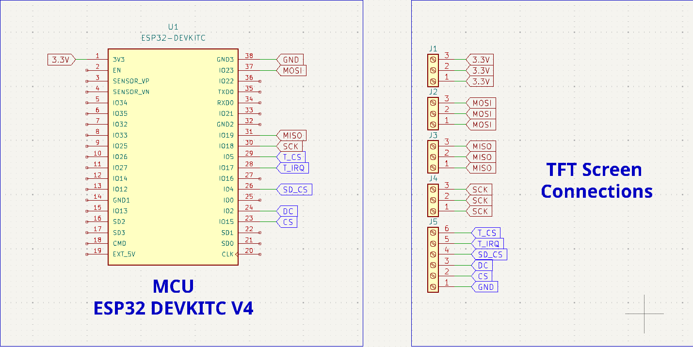
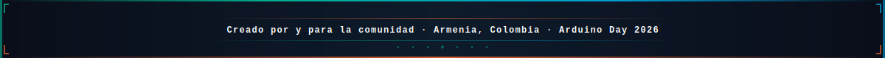

<div align="center">

[](https://www.arduino.cc/)
[](https://www.espressif.com/)
[](https://lvgl.io/)
[](https://platformio.org/)
[](https://eezstudio.github.io/)

</div>




---

## Introducción

Este proyecto surge como material educativo para el **Arduino Day 2026**, con el objetivo de democratizar el uso de pantallas TFT en proyectos embebidos. Durante años, las interfaces gráficas en microcontroladores han sido consideradas un terreno exclusivo para expertos, pero con herramientas como **LVGL** y **EEZ Studio**, cualquier persona con conocimientos básicos de programación puede crear interfaces profesionales.

### ¿Por qué este proyecto?

Las pantallas TFT (Thin-Film Transistor) ofrecen una forma visual e interactiva de presentar información en proyectos con microcontroladores. Sin embargo, configurar el entorno, entender los protocolos de comunicación y diseñar interfaces atractivas puede resultar abrumador para principiantes.

Este proyecto proporciona:

- Configuración lista para usar con ESP32 y ILI9341
- Biblioteca LVGL v8.3.11 completamente configurada
- Interfaz visual diseñada en EEZ Studio
- Ejemplo funcional con widgets interactivos (ColorWheel, Slider, LED)
- Documentacion paso a paso para Windows, Linux y macOS

---

## Requisitos de Hardware

| Componente | Descripcion |
|------------|-------------|
| **ESP32** | Modulo ESP32 DevKitC o compatible |
| **Pantalla TFT** | Display ILI9341 de 2.8" (320x240 píxeles) |
| **Touchscreen** | Controlador XPT2046 integrado |
| **Cables** | Jumpers Dupont (M-M, M-H, H-H) |
| **Fuente** | Fuente 5V/3.3V compatible con ESP32 |

### Pantalla TFT 2.8"



La pantalla usada en este proyecto es un display TFT de **2.8 pulgadas** con resolución de 320x240 píxeles, compatible con el controlador **ILI9341** y touchscreen **XPT2046**. Puedes adquirirla en tiendas de electrónica o marketplaces como AliExpress, Amazon o Mercado Libre.

### Conexiones GPIO

| Pines ESP32 | Pines TFT |
|-------------|-----------|
| GPIO 19     | MISO      |
| GPIO 23     | MOSI      |
| GPIO 18     | SCK       |
| GPIO 15     | CS        |
| GPIO 2      | DC        |
| GPIO 4      | Touch CS  |
| GPIO 16     | Touch IRQ |
| 3.3V        | RST       |
| 3.3V        | VCC       |
| GND         | GND       |

### Diagrama de Conexiones



> **Nota importante:** Las etiquetas de color **rojo** en el diagrama representan pines que requieren consultar la hoja de datos del microcontrolador, ya que pueden variar dependiendo de la version del MCU o si se utiliza un microcontrolador diferente. Las etiquetas de color **azul** corresponden a pines que pueden ser cualquier GPIO disponible, segun la conveniencia y criterio del desarrollador.

---

## Instalacion del Entorno de Desarrollo

### 1. Instalacion de VSCode

#### Windows
1. Descarga **Visual Studio Code** desde [code.visualstudio.com](https://code.visualstudio.com/)
2. Ejecuta el instalador `.exe`
3. Acepta los términos y selecciona las opciones recomendadas
4. Reinicia tu computadora después de la instalación

#### Linux (Ubuntu/Debian)
```bash
# Descargar e instalar
wget -qO- https://packages.microsoft.com/keys/microsoft.asc | gpg --dearmor > packages.microsoft.gpg
sudo install -o root -g root -m 644 packages.microsoft.gpg /usr/share/keyrings/
sudo sh -c 'echo "deb [arch=amd64 signed-by=/usr/share/keyrings/packages.microsoft.gpg] https://packages.microsoft.com/repos/vscode stable main" > /etc/apt/sources.list.d/vscode.list'
sudo apt update
sudo apt install code
```

#### macOS
1. Descarga **Visual Studio Code** desde [code.visualstudio.com](https://code.visualstudio.com/)
2. Arrastra el archivo `.zip` a tu carpeta de Aplicaciones
3. Abre VSCode desde Spotlight

---

### 2. Instalacion de PlatformIO

#### Windows, Linux y macOS
1. Abre **VSCode**
2. Ve a las **Extensiones** (Ctrl+Shift+X / Cmd+Shift+X)
3. Busca **PlatformIO IDE**
4. Haz clic en **Instalar**
5. Espera a que complete la instalación (puede tomar varios minutos)
6. Reinicia VSCode cuando termine

> **Nota:** PlatformIO requiere aproximadamente 500MB de espacio en disco para las dependencias.

---

### 3. Instalacion de EEZ Studio

EEZ Studio es una herramienta gratuita de código abierto para diseñar interfaces LVGL visualmente.

#### Windows
1. Descarga **EEZ Studio** desde [eez studio.github.io](https://eezstudio.github.io/)
2. Ejecuta el instalador `.exe` o `.msi`
3. Sigue las instrucciones del asistente

#### Linux (Ubuntu/Debian)
```bash
# Opción 1: Descargar AppImage
wget https://github.com/eezstudio/eez-studio/releases/latest/download/eez-studio-linux-x64.AppImage
chmod +x eez-studio-linux-x64.AppImage
./eez-studio-linux-x64.AppImage

# Opción 2: Usar Flatpak (si está disponible)
flatpak install eez-studio
```

#### macOS
1. Descarga **EEZ Studio** desde [eez studio.github.io](https://eezstudio.github.io/)
2. Arrastra el archivo `.dmg` a tu carpeta de Aplicaciones
3. Abre la aplicación (puede requerir permisos en Preferencias del Sistema)

---

## Instalacion del Proyecto

### Clonar el Repositorio

```bash
# Usando Git
git clone https://github.com/TU_USUARIO/arduino-day-guia-pantallas-tft.git
cd arduino-day-guia-pantallas-tft/Codigo/arduino-day

# O descargando ZIP
# 1. Ve a https://github.com/TU_USUARIO/arduino-day-guia-pantallas-tft
# 2. Clic en "Code" > "Download ZIP"
# 3. Extrae el archivo en tu carpeta de proyectos
```

### Compilar el Proyecto

```bash
# Abrir carpeta del proyecto en VSCode
# File > Open Folder > seleccionar carpeta "arduino-day"

# PlatformIO detectará automáticamente platformio.ini
# Compilar: PlatformIO: Build (Ctrl+Alt+b / Cmd+Alt+b)
```

### Subir el Firmware

```bash
# Método 1: Desde PlatformIO
# PlatformIO: Upload (Ctrl+Alt+u / Cmd+Alt+u)

# Método 2: Desde terminal
pio run --target upload
```

---

## Configuración en EEZ Studio

Al crear un nuevo proyecto en EEZ Studio para TFT con ESP32, es fundamental configurar los siguientes parámetros:

### General

- **Resolution (Ancho x Alto)**: Verificar que coincida con las dimensiones de la pantalla (320x240 para ILI9341 de 2.8")
- Ajustar según el modelo de pantalla utilizada

### Build

- **Destination Folder**: Asegurarse de que apunte a la carpeta `ui` del proyecto de PlatformIO
- Esta configuración determina dónde se generarán los archivos de la interfaz

### LVGL Include

- Por defecto, EEZ Studio puede generar: `lvgl/lvgl.h`
- **Importante**: Cambiar a simplemente `lvgl.h` para evitar errores de compilación

### Aspectos Importantes en EEZ Studio

**Nombrado de widgets**: Para manipular elementos desde EEZ Studio o desde código, cada widget debe tener un nombre asignado. Esto permite referenciarlos fácilmente en el código y crear interacciones.

**Variables globales**: EEZ Studio permite definir variables globales de diferentes tipos (entero, texto, booleano, etc.) que pueden utilizarse para almacenar estados o valores que se comparten entre la interfaz y el código.

**Recursos gráficos**: Se pueden cargar fuentes e imágenes en formato bitmap para usarlas en los widgets. Esto incluye iconos, imágenes de fondo y fuentes personalizadas.

**User Widgets**: Esta funcionalidad permite crear widgets personalizados que pueden reutilizarse en diferentes pantallas. Es útil para componentes complejos que se usan múltiples veces.

---

## Configuración en PlatformIO

### platformio.ini

El archivo `platformio.ini` es el **corazón de la configuración** del proyecto. Acá definimos el hardware, las librerías y los parámetros de comunicación.

#### Seccion [env:rymcu-esp32-devkitc]

```ini
[env:rymcu-esp32-devkitc]
platform = espressif32
board = rymcu-esp32-devkitc
framework = arduino
monitor_speed = 115200
upload_speed = 921600
```

| Campo | Valor | Para qué sirve |
|-------|-------|----------------|
| `platform` | `espressif32` | Framework/compilador para chips ESP32 de Espressif |
| `board` | `rymcu-esp32-devkitc` | Placa de desarrollo con ESP32-WROOM-32 |
| `framework` | `arduino` | Usa el framework Arduino (API estándar) |
| `monitor_speed` | 115200 | Velocidad del puerto serie para debug (println) |
| `upload_speed` | 921600 | Upload rápido al ESP32 (carga el código más rápido) |

**¿Por qué ESP32?**
- WiFi y Bluetooth integrados
- Dual-core (240 MHz) - mucho más potente que Arduino UNO
- Ideal para manejar pantallas TFT grandes y LVGL

#### Librerias (lib_deps)

```ini
lib_deps =
	bodmer/TFT_eSPI@^2.5.43
	paulstoffregen/XPT2046_Touchscreen@0.0.0-alpha+sha.26b691b2c8
	lvgl/lvgl@8.3.11
```

##### TFT_eSPI (Bodmer/TFT_eSPI@^2.5.43)

Esta es la librería **MÁS IMPORTANTE** del proyecto:

- Abstrae TODO el manejo de la pantalla TFT
- Habla SPI con el controlador ILI9341
- Tiene drivers para MUCHOS otros controladores (ST7789, ILI9488, etc.)
- Es MUCHO más rápida que las librerías Adafruit originales

El `^2.5.43` significa "versión 2.5.43 o cualquier versión mayor en el mismo major" (semantic versioning).

##### XPT2046 Touchscreen (paulstoffregen/XPT2046_Touchscreen)

Este es el **chip controlador de la pantalla táctil**. Cuando tocas la pantalla:

1. El táctil genera una señal analógica
2. El XPT2046 la convierte en digital
3. Esta librería lee las coordenadas X, Y

El `@0.0.0-alpha+sha.26b691b2c8` es una versión **pre-release** (no stable), tomada de un commit específico de Git.

##### LVGL (lvgl/lvgl@8.3.11)

**LVGL = Light and Versatile Graphics Library**

Es una librería de UI de código abierto que permite:
- Crear botones, sliders, labels, etc.
- Hacer interfaces interactivas
- Animaciones fluidas
- Themes personalizables

Es como tener un mini React/Flutter para microcontroladores.

#### Build Flags (La magia de la configuración)

```ini
build_flags =
	-I${src_dir}
	-D LV_CONF_INCLUDE_SIMPLE
	-D USER_SETUP_LOADED=1
	-D ILI9341_DRIVER=1
	-D TFT_MISO=19
	-D TFT_MOSI=23
	-D TFT_SCLK=18
	-D TFT_CS=15
	-D TFT_DC=2
	-D TFT_RST=-1
	-D SPI_FREQUENCY=55000000
	-D SPI_TOUCH_FREQUENCY=2500000
```

##### Flags básicos

| Flag | Valor | Explicación |
|------|-------|-------------|
| `-I${src_dir}` | (ruta) | Agrega el directorio src al include path del compilador |
| `-D LV_CONF_INCLUDE_SIMPLE` | (definición) | Le dice a LVGL "usar config simplificada" |
| `-D USER_SETUP_LOADED=1` | (definición) | **CRÍTICO** - Le decís a TFT_eSPI "voy a definir mi propia config" |

El `-D` significa "define" - es como un `#define` global en C.

##### El Driver de la pantalla

```ini
-D ILI9341_DRIVER=1
```

Esto le dice a TFT_eSPI que el controlador de tu pantalla es un **ILI9341**. Este es un controlador muy común en pantallas de 2.4" y 2.8".

Otros drivers disponibles:
- `ST7789_DRIVER` - pantallas de 1.3", 1.54", 2.0"
- `ILI9488_DRIVER` - pantallas de 3.5" o 4" (más resolución)
- `HX8357D_DRIVER` - otras comunes

##### Pines SPI (La conexión física)

```ini
-D TFT_MISO=19
-D TFT_MOSI=23
-D TFT_SCLK=18
```

Estos son los **pines del bus SPI** que usa la pantalla:

```
ESP32                    Pantalla TFT (ILI9341)
----------------------------------------------------
GPIO 23 (MOSI)  -------> MOSI
GPIO 19 (MISO)  -------> MISO  (solo si usas lectura)
GPIO 18 (CLK)   -------> SCK
GPIO 15         -------> CS    (Chip Select)
GPIO 2          -------> DC    (Data/Command)
```

**Por que estos pines?** El ESP32 tiene multiples buses SPI:
- **HSPI** (default): pines 12-15, 18-19
- **VSPI** (default): pines 5, 18-23, 19

TFT_eSPI por defecto usa HSPI. Los pines 18, 19, 23 son los "default" del VSPI.

##### Pines de control

```ini
-D TFT_CS=15      # Chip Select - activa la pantalla
-D TFT_DC=2       # Data/Command - distingue comandos de datos
-D TFT_RST=-1    # Reset - -1 = no usado (se usa software reset)
```

| Pin | Funcionalidad | Explicación |
|-----|---------------|-------------|
| `TFT_CS` | Chip Select | Cuando está en LOW, el ESP32 "habla" con la pantalla |
| `TFT_DC` | Data/Command | HIGH = datos (píxeles), LOW = comandos (config) |
| `TFT_RST` | Reset | -1 significa "no conectado" - se resetea por software |

**¿Por qué `TFT_RST=-1`?** Porque muchos módulos TFT ya tienen el reset conectado a 3.3V o no lo tienen disponible. LVGL/TFT_eSPI pueden hacer un soft-reset.

##### Frecuencias SPI

```ini
-D SPI_FREQUENCY=55000000
-D SPI_TOUCH_FREQUENCY=2500000
```

| Frecuencia | Valor | Explicación |
|------------|-------|-------------|
| `SPI_FREQUENCY` | 55 MHz | Velocidad de datos hacia la pantalla (la máxima del ILI9341 es 55MHz) |
| `SPI_TOUCH_FREQUENCY` | 2.5 MHz | Velocidad para leer el táctil (mucho más lenta, más precisa) |

**55 MHz es el máximo** del ILI9341. A mayor frecuencia, más rápido se actualiza la pantalla. Pero si tienes ruido o cables largos, quizás necesites bajarlo a 40 MHz o 26 MHz.

**2.5 MHz para el táctil** es más que suficiente - el XPT2046 solo puede leer a ~125 kHz de todas formas.

#### Resumen Visual de las Conexiones

```
ESP32 GPIO                 Funcionalidad              Pantalla TFT
---------------------------------------------------------------
GPIO 23 (MOSI)   ----->   Datos (escritura)        MOSI
GPIO 19 (MISO)   ----->   Datos (lectura)          MISO  
GPIO 18 (SCK)    ----->   Clock                    SCK
GPIO 15 (CS)     ----->   Chip Select              CS
GPIO 2 (DC)      ----->   Data/Command              D/C
---               ----->   Reset                    (no conectado)
GPIO 4            ----->   Touch CS                 T_CS (del XPT2046)
GPIO 33           ----->   Touch IRQ                T_IRQ (interrupcion)
```

> **Nota importante:** En el diagrama de conexiones, las etiquetas de color **rojo** representan pines que requieren consultar la hoja de datos del microcontrolador, ya que pueden variar dependiendo de la versión del MCU o si se utiliza un microcontrolador diferente. Las etiquetas de color **azul** corresponden a pines que pueden ser cualquier GPIO disponible, según la conveniencia y criterio del desarrollador.

Este archivo contiene la configuración de LVGL. Esencial activar los widgets que se utilizarán:

```c
// Resolucion de la pantalla
#define LV_HOR_RES_MAX 320
#define LV_VER_RES_MAX 240

// Widgets necesarios
#define LV_USE_COLORWHEEL 1
#define LV_USE_LED        1
#define LV_USE_SLIDER     1
```

### main.cpp

El archivo principal debe inicializar:

1. **TFT_eSPI**: Controlador del display
2. **XPT2046**: Controlador touchscreen
3. **LVGL**: Biblioteca gráfica
4. **UI**: Interfaz generada por EEZ Studio
5. **Callbacks**: Funciones de respuesta a eventos

---

## Estructura del Proyecto

```
arduino-day/
├── platformio.ini          # Configuración de PlatformIO
├── src/
│   ├── main.cpp           # Punto de entrada del programa
│   ├── lv_conf.h         # Configuración de LVGL
│   ├── LedController.cpp # Controlador LED (ColorWheel -> LED)
│   ├── LedController.h
│   └── ui/                # Archivos generados por EEZ Studio
│       ├── screens.c/h   # Definición de pantallas
│       ├── ui.c/h        # Inicialización de UI
│       ├── eez-flow.c/h  # Flujo de eventos
│       ├── styles.c/h     # Estilos
│       ├── fonts/        # Fuentes personalizadas
│       └── images/       # Imágenes
└── .pio/                  # Dependencias de PlatformIO (auto-generado)
```

---

## Funcionalidades del Ejemplo

El proyecto incluye una pantalla de demostración con:

| Widget | Función |
|--------|---------|
| **ColorWheel** | Seleccionar color para el LED |
| **Slider** | Ajustar brillo del LED (0-255) |
| **LED** | Mostrar color y brillo seleccionados |
| **Botón Atrás** | Navegar entre pantallas |
| **Switch** | Ejemplo de interruptor |
| **Checkbox** | Ejemplo de casilla de verificación |

---

## Recursos Adicionales

- [Documentación LVGL](https://docs.lvgl.io/8.3/)
- [Documentación TFT_eSPI](https://github.com/Bodmer/TFT_eSPI)
- [Documentación EEZ Studio](https://eezstudio.github.io/docs/)
- [Documentación PlatformIO](https://docs.platformio.org/)

---

## Contribuciones

Las contribuciones son bienvenidas. Si encuentras errores o quieres mejorar la documentación, no dudes en crear un **Pull Request**.

---

## Licencia

Este proyecto está bajo la licencia MIT. Consulta el archivo `LICENSE` para más información.

---


